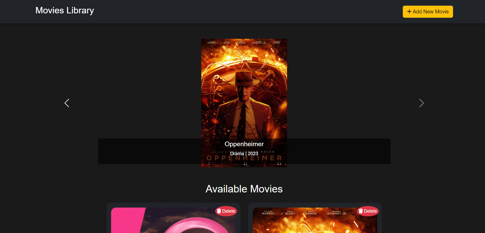
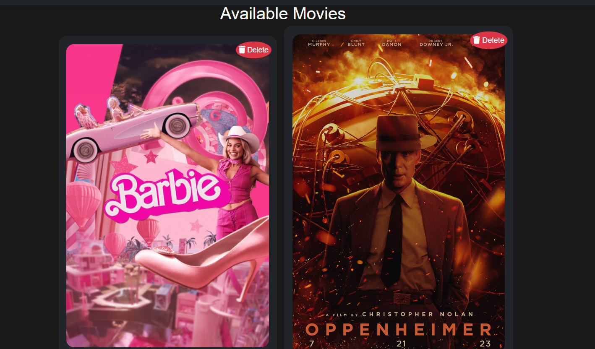
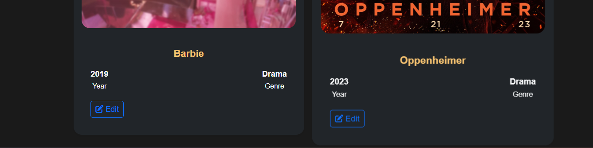
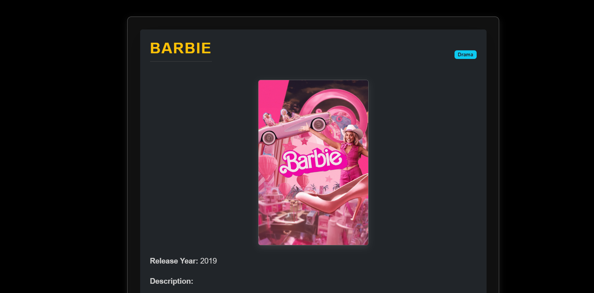
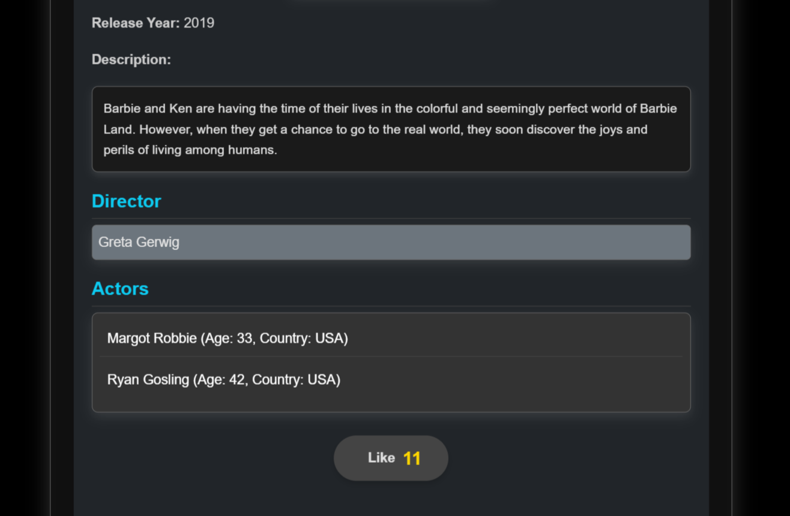
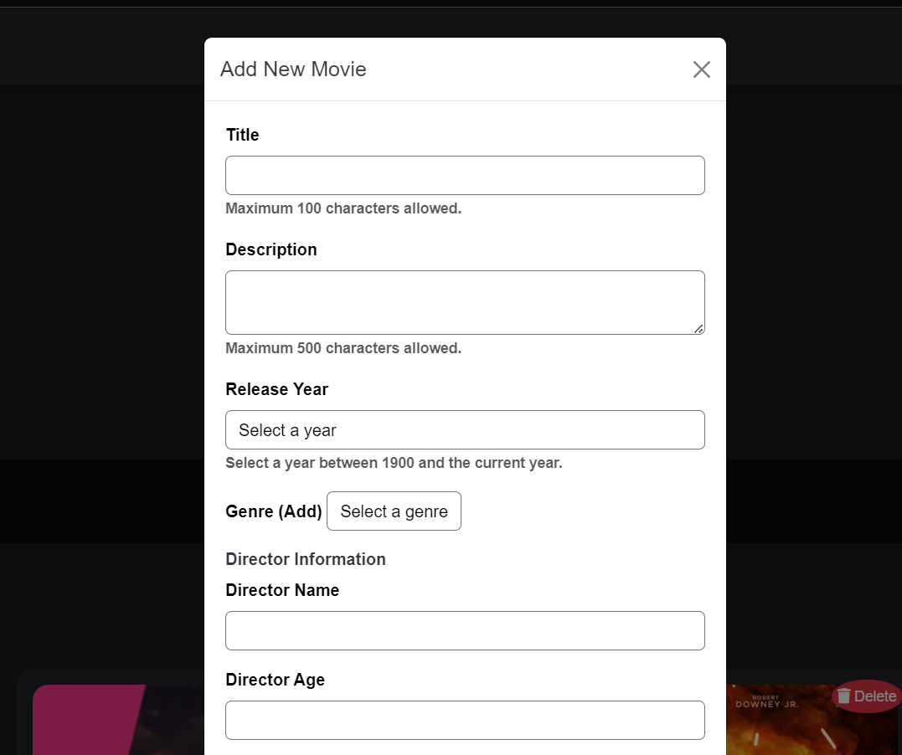
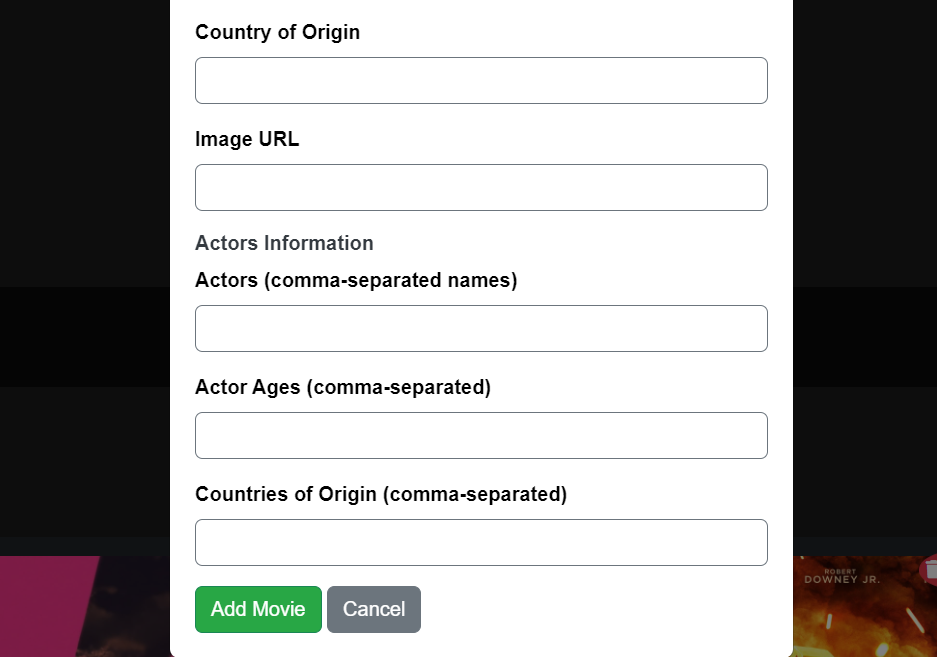
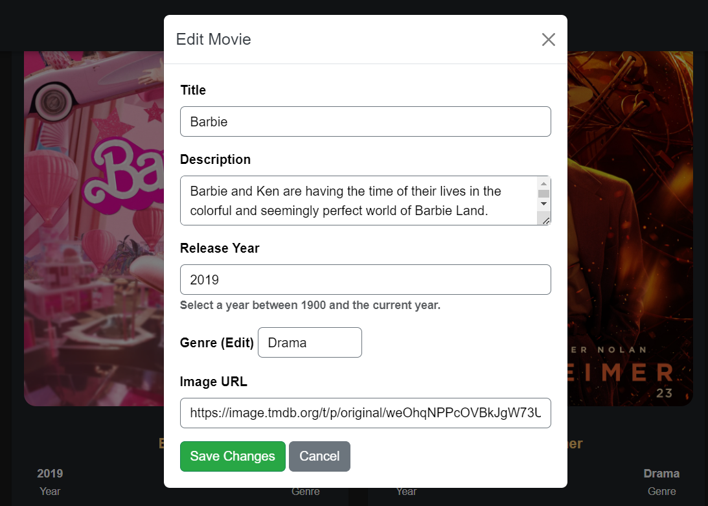
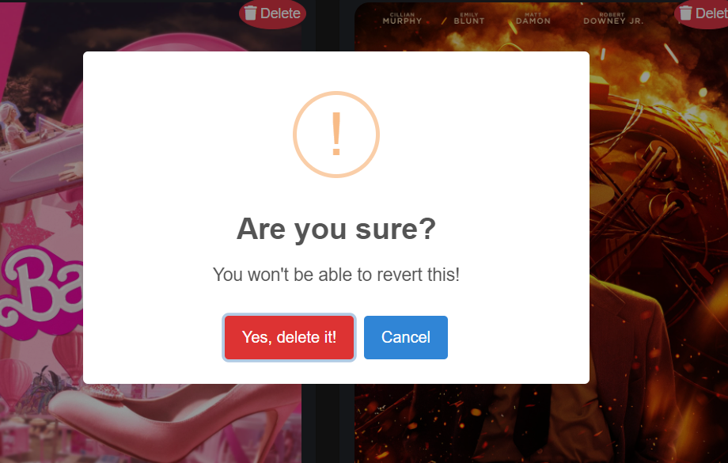
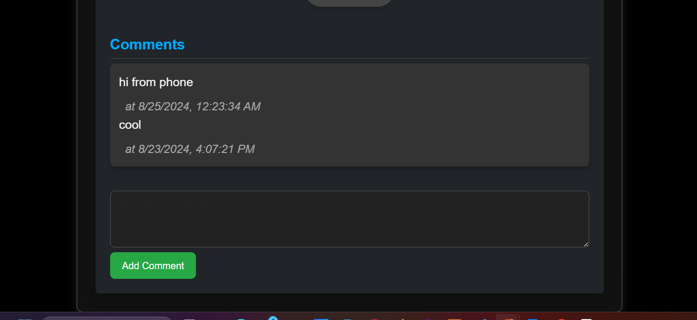

# Movie Library Website

## Description
This website allows users to browse, search, add, update, and delete movie details. It includes features such as viewing movie details, adding actors, liking movies, and leaving comments.

## Features
- Add/Edit/Delete movies with details (title, description, release year, genre, etc.)
- Actor management (add actors and link them to movies)
- Comment and like functionality
- User-friendly interface with Bootstrap and SweetAlert2

## Technologies
- Frontend: HTML, CSS, Bootstrap, jQuery
- Backend: Node.js, Express.js, SQLite
- Libraries: SweetAlert2
  


## Installation
1. Clone the repository:
   ```bash
   git clone https://github.com/omermohammed9/Movies-Library-Application-Pure-Platform.git


   ## Screenshots

### Home Page
Here is a screenshot of the home page where users can browse all available movies.


### Availabe Movies-1


### Availabe Movies-2



### Movie Details-1
This screenshot shows the detailed view of a movie, including comments and likes.


### Movie Details-2
This screenshot shows the detailed view of a movie, including comments and likes.


### Add Movie-1
This image demonstrates the interface for adding a new movie to the library.


### Add Movie-2
This image demonstrates the interface for adding a new movie to the library.


### Edit Movie-1
Here is how users can update movie details.


### Edit Movie-2
Here is how users can update movie details.


### Delete Movie
A view of the prompt confirming a movie deletion.


### Actor Management
Screenshot showing how actors are added and linked to movies.

